# SwapSkill - Architecture Deep Dive

## 🏗️ System Architecture Overview

SwapSkill is built using a modern microservices-inspired architecture with clear separation of concerns, scalable design patterns, and production-ready infrastructure.

## 📐 Architecture Diagrams

### 1. High-Level System Architecture

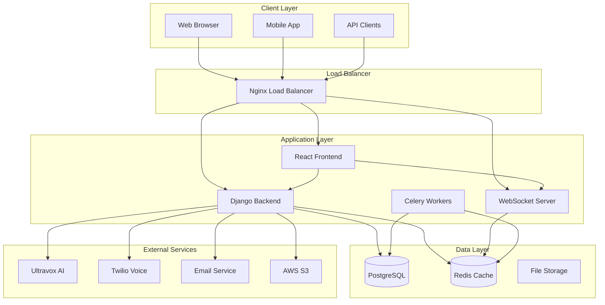

### 2. Database Entity Relationship Diagram

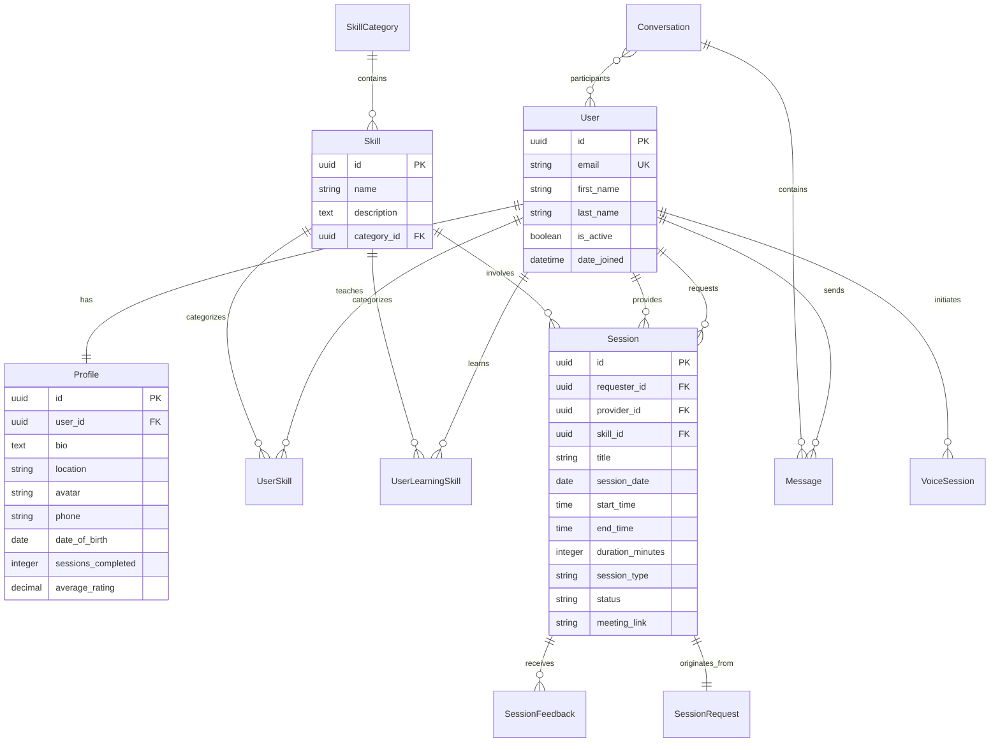

### 3. API Architecture Flow

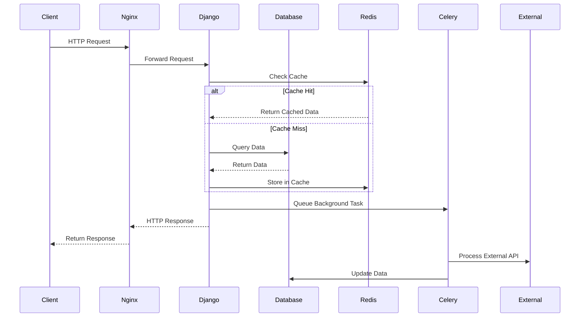

## 🔧 Component Architecture

### Frontend Architecture (React/TypeScript)

```
src/
├── components/           # Reusable UI components
│   ├── ui/              # Basic UI elements
│   ├── forms/           # Form components
│   ├── layout/          # Layout components
│   └── features/        # Feature-specific components
├── pages/               # Page components
├── hooks/               # Custom React hooks
├── services/            # API service layer
├── store/               # State management
├── utils/               # Utility functions
├── types/               # TypeScript type definitions
└── assets/              # Static assets
```

**Key Design Patterns:**
- **Component Composition**: Reusable components with clear interfaces
- **Custom Hooks**: Business logic separation from UI components
- **Service Layer**: Centralized API communication
- **Type Safety**: Comprehensive TypeScript coverage
- **Error Boundaries**: Graceful error handling

### Backend Architecture (Django/DRF)

```
skillswap/
├── users/               # User management
├── skills/              # Skill system
├── skill_sessions/      # Session management
├── chat_messages/       # Real-time messaging
├── voice_ai/           # AI integration
├── utils/              # Shared utilities
│   ├── error_handlers.py
│   ├── validators.py
│   ├── security.py
│   ├── performance.py
│   └── middleware.py
└── skillswap/          # Project settings
```

**Key Design Patterns:**
- **Model-View-Serializer**: Clean separation of concerns
- **Custom Middleware**: Cross-cutting concerns handling
- **Service Layer**: Business logic encapsulation
- **Repository Pattern**: Data access abstraction
- **Dependency Injection**: Loose coupling between components

## 🔄 Data Flow Architecture

### 1. User Authentication Flow

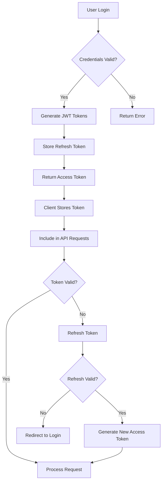

### 2. Real-time Messaging Flow

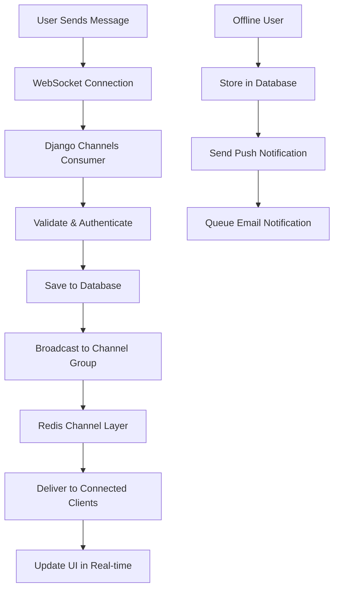

### 3. Voice AI Integration Flow

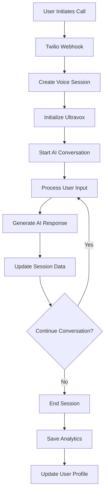

## 🛡️ Security Architecture

### Authentication & Authorization

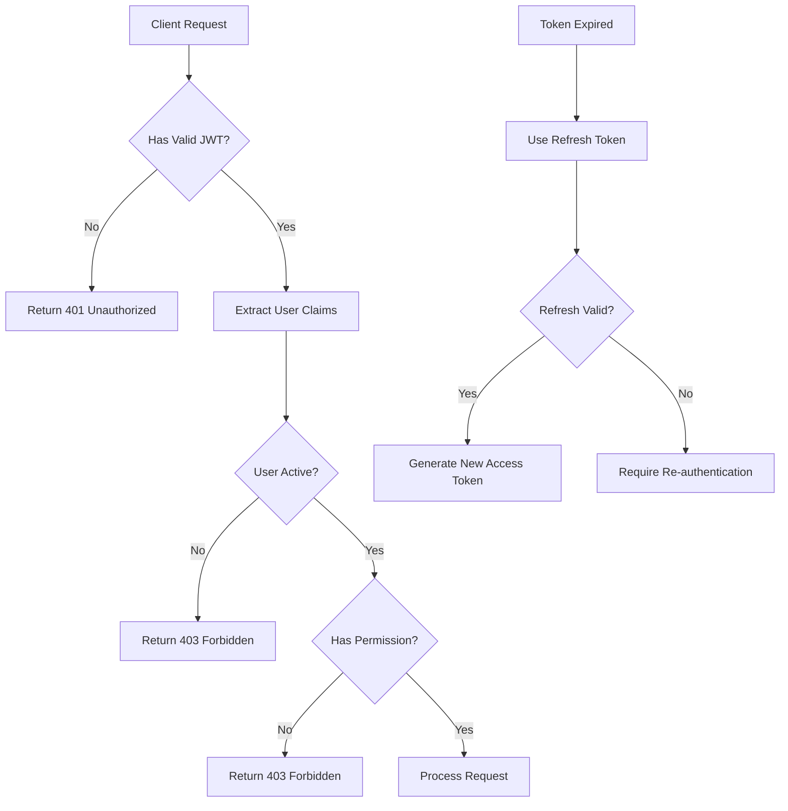

### Security Layers

1. **Network Security**
   - HTTPS/TLS encryption
   - CORS policy enforcement
   - Rate limiting per IP/user
   - DDoS protection

2. **Application Security**
   - Input validation and sanitization
   - SQL injection prevention
   - XSS protection with CSP
   - CSRF token validation

3. **Authentication Security**
   - JWT with short expiration
   - Refresh token rotation
   - Password strength requirements
   - Account lockout policies

4. **Data Security**
   - Database encryption at rest
   - Sensitive data hashing
   - PII data protection
   - Audit logging

## 📈 Performance Architecture

### Caching Strategy

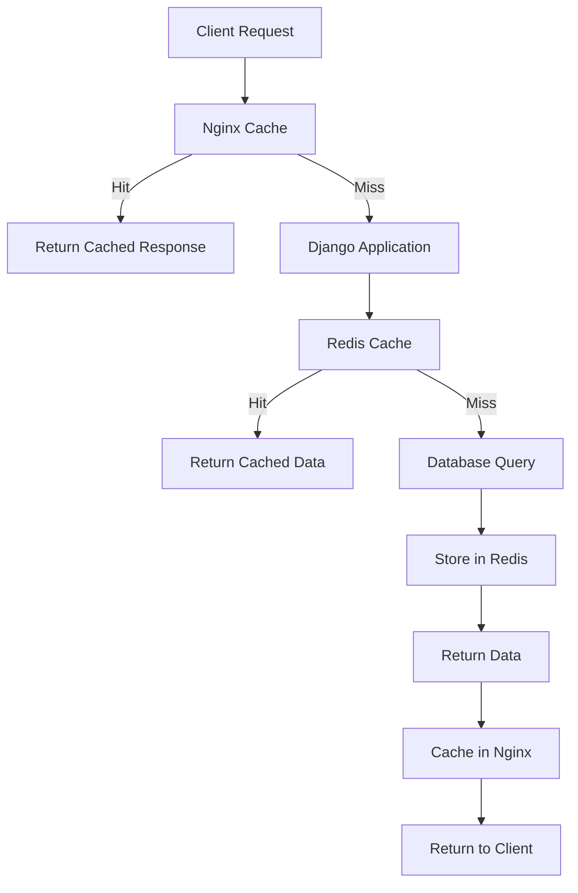

**Cache Layers:**
1. **Browser Cache**: Static assets and API responses
2. **CDN Cache**: Global content delivery
3. **Nginx Cache**: Reverse proxy caching
4. **Redis Cache**: Application-level caching
5. **Database Cache**: Query result caching

### Database Optimization

**Query Optimization Techniques:**
- **Select Related**: Reduce N+1 queries with joins
- **Prefetch Related**: Optimize many-to-many relationships
- **Database Indexing**: Strategic index placement
- **Connection Pooling**: Efficient connection management
- **Read Replicas**: Distribute read operations

**Example Optimized Query:**
```python
# Before: N+1 queries
users = User.objects.all()
for user in users:
    print(user.profile.bio)  # Additional query per user

# After: 2 queries total
users = User.objects.select_related('profile').all()
for user in users:
    print(user.profile.bio)  # No additional queries
```

## 🔄 Scalability Architecture

### Horizontal Scaling Strategy

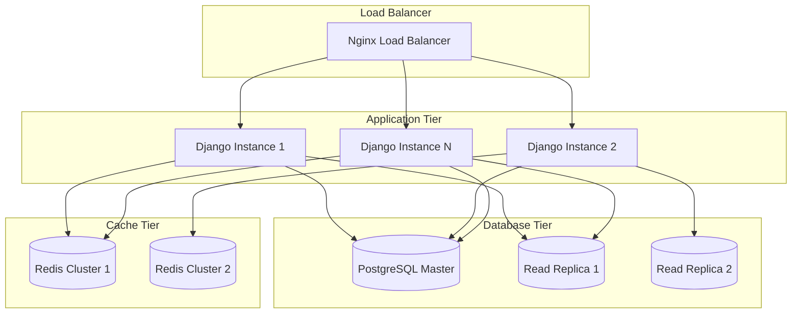

### Auto-scaling Configuration

**Metrics-based Scaling:**
- CPU utilization > 70%
- Memory usage > 80%
- Response time > 500ms
- Queue depth > 100 jobs

**Scaling Policies:**
- Scale out: Add instances when thresholds exceeded
- Scale in: Remove instances when load decreases
- Minimum instances: 2 (high availability)
- Maximum instances: 20 (cost control)

## 🔍 Monitoring Architecture

### Observability Stack

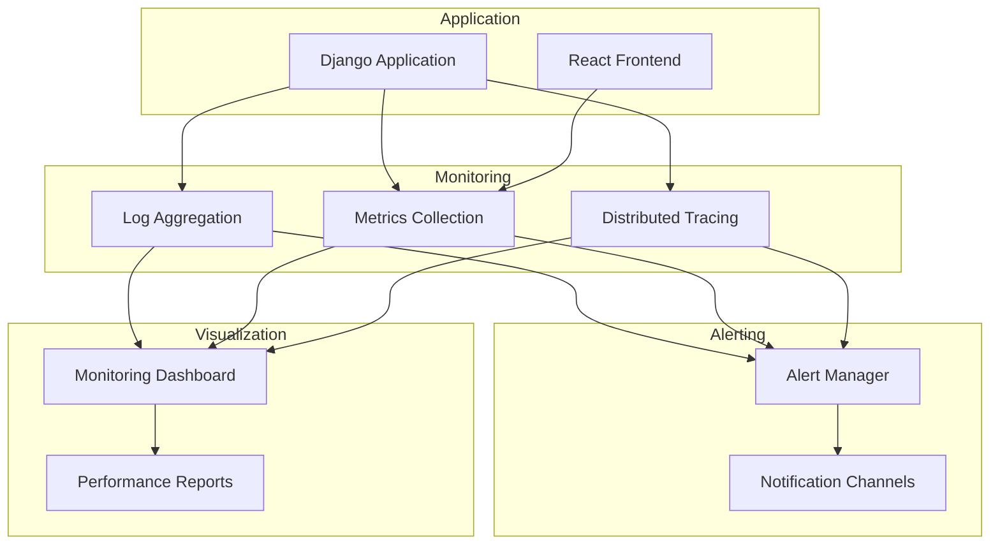

### Key Metrics Tracked

**Application Metrics:**
- Request rate and response time
- Error rate and types
- Database query performance
- Cache hit/miss ratios
- WebSocket connection count

**Infrastructure Metrics:**
- CPU and memory utilization
- Disk I/O and network traffic
- Database connection pool usage
- Queue depth and processing time

**Business Metrics:**
- User registration and activation
- Session booking and completion rates
- Message volume and engagement
- Voice AI usage and satisfaction

## 🚀 Deployment Architecture

### CI/CD Pipeline

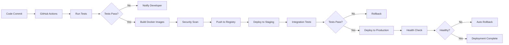

### Infrastructure as Code

**Docker Compose Configuration:**
- Multi-service orchestration
- Environment-specific overrides
- Volume management
- Network isolation
- Health checks

**Production Deployment:**
- Blue-green deployment strategy
- Rolling updates with zero downtime
- Automated rollback on failure
- Database migration handling
- Static asset optimization

This architecture demonstrates enterprise-grade system design with scalability, security, and maintainability as core principles. The modular design allows for independent scaling of components and easy integration of new features.
